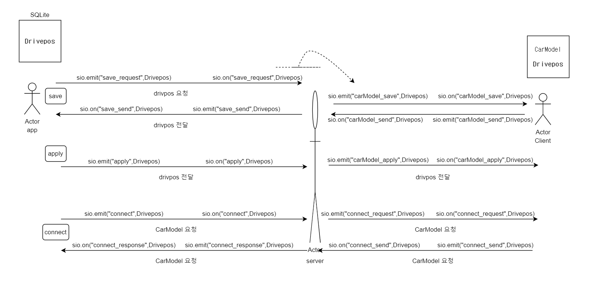
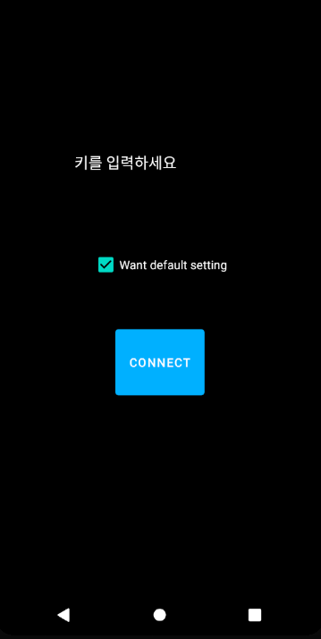
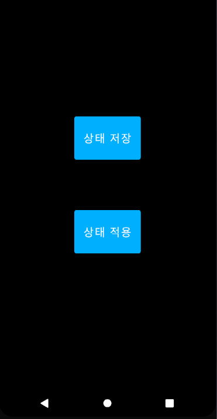

# Android app

사용자 DrivePosition 데이터를 저장하고 적용하기 위한 어플입니다.

 

## ConnectActivity
-------------------
기본적인 connect 세팅을 합니다.
1. 변수
> - `height` -> 키를 저장합니다.
> - `setting` -> setting을 기본으로 할지 저장합니다.
> - `data` -> `msocket.on("connect_response")`를 통해 차량 정보를 받아옵니다.

2. 시나리오
> - 처음 접속시 `height==null`이고 checkbox의 `ischecked()==true`이다. 그래서 키를 입력하지 않으면 toast message를 통해 키를 입력하라고 나온다. checkbox는 check하면 1, 즉 기본 세팅이고 check를 해제하면 2, 사용자 설정이다.
> - 키를 입력하면 connect 버튼을 누를 수 있고 connect_response를 통해 CarModel의 `data`를 받으면 다음 창에서 save버튼을 통해 db에 저장할 수 있다. 
> - 이미 db에 키 정보와 checkbox 정보가 등록되어 있다면 connectActivity접속시 디비의 정보를 읽어와 UI에 반영한다.

  

## MainActivity
----------------
1. save 버튼
> - save 버튼을 누르면 `msocket.emit("save_request")`을 통해 save정보를 요청하게 되고 `msocket.on("save_send")`를 통해 사용자의 DrivePosition을 받아오게 된다. 그리고 height, setting, driveposition을 insert 혹은 update하게 된다.
2. apply 버튼
> - 만약 save 버튼을 먼저 누르지 않고 apply버튼을 누르면 사용자 drivepostion에 대한 정보가 없으므로 save버튼을 먼저 누르라고 toast message가 뜬다
> - save 버튼을 누른 후 다른 차량에 탑승 후 apply 버튼을 누르게 되면 사용자의 height, setting, driveposition이 서버에 전송된다.

