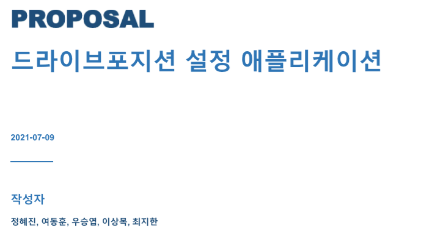

### 프로젝트 요약
 

 기존의 메모리시트는 차량내부에 각 운전자별 드라이브 포지션을 저장시켜놓고 하나의 차량을 여러명이 이용할 때 운전자가 시트의 위치를 이리저리 움직일 필요없이 즉시 설정해놓은 셋팅값으로 맞춰주는 기능을 한다. 자동차를 패밀리카로 이용하는경우 운전자가 몇명없기 때문에 기존의 메모리시트 성능이면 충분하다. 하지만 SOCAR, GreenCAR 등의 카셰어링 어플의 경우 이용자가 많기 때문에 차량을 대여하면 운전자가 시트를 편한자세에 맞춰 직접 조정할 수 밖에 없다.

 국내 카셰어링 업계 1위인 SOCAR의 회원수는 2014년 50만명에서 2019년말 580만명으로 증가하였고 보유차량도 1만2천여대로 증가하는등 카셰어링 시장의 규모가 점점 커지고 있다. 또한 국내 렌터카 시장도 2001년 집계를 시작한 이후 연간 15.9%씩 규모를 키워가고 있는 상황이다. 이러한 상황에서 기존의 메모리시트가 3~4명의 설정값만 저장할 수 있었던것과 다르게 모든 차량모델에 대해 고객이 서비스를 이용할 때 마다 시트위치, 사이드미러 등의 드라이브포지션 데이터가 저장된 휴대폰을 이용하여 차량에 데이터를 넘겨주고 서비스를 이용할 때 마다 즉시 운전자가 편한 드라이브포지션으로 설정될 수 있도록 하는것이 프로젝트의 목표다.

 프로젝트가 성공적으로 구현된다면 카셰어링 어플과 연동하여 유용하게 이용되거나 앱스토어에 배포하여 일반 렌트카업체에서 빌린 차량을 이용할때도 차량이 안드로이드 오토를 지원한다면 유용하게 이용될 수 있을것으로 예상된다.
